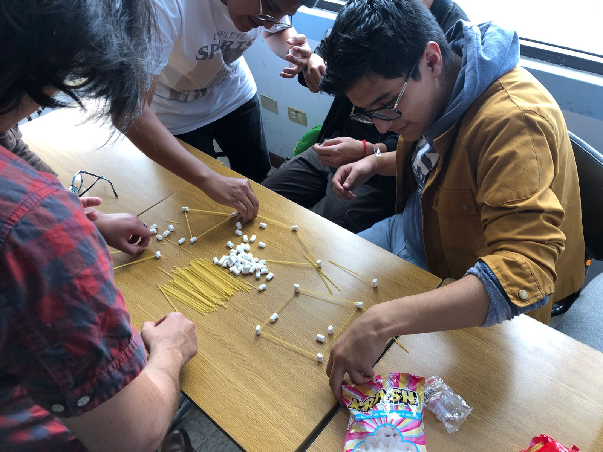
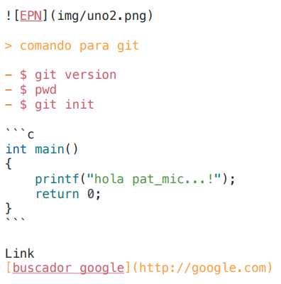
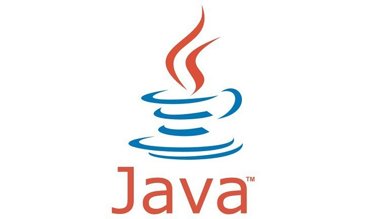
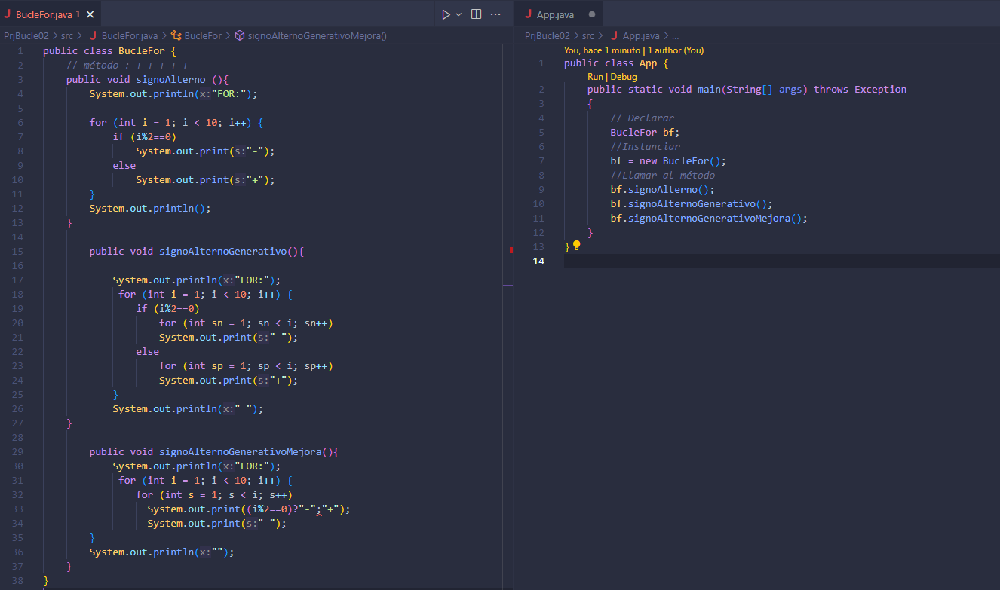
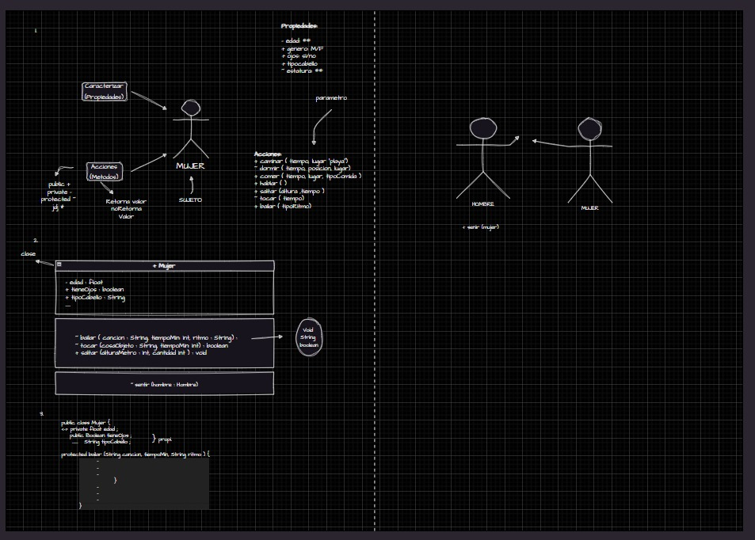

**ESCUELA POLITECNICA NACIONAL**
----------------------------------------------------------------------------
### *Facultad de Ingenieria en Sistemas/Computacion*

----------------------------------------------------------------------------
```Date: Lunes 29 de abril```

# Primera Clase

## Presentacion : Datos Generales 
Carrera : Ingenieria en software / computacion 

Asignatura : Programacion II

Tutor : Patricio Paccha | pat_mic

## Sistema de evaluacion 


## Contenido 
- Colaborativos 
- Flexibles 
- Honestos 
- Curiosos 
- Cultura organizacional 
- Normativa
- Codigo de etica 

## Recursos - TALLER MA01 
- Trabajo colaborativo 
- Material: fideos, marshmallows, cinta metrica, cinta adhesiva



```Date: Martes 30 de abril```

# Segunda Clase

## *Comandos Linux*

1. pwd : lugar actual

2. touch readme.md : crear archivos  

3. code readme.md : abrir archivos     

4. ls : listar archivos y carpetas 

5. cd : cambia directorio de trabajo 

6. mkdir : crea nuevo directorio
   
7. rm : elimina un archivo 

8. cp : copiar archivos-directorios (incluido contenido)

9. mv : mueve o renombra archivos-directorios

10. file : comprueba tipo archivo

11. ls-la : lista ocultar archivos y directorios

12. nano, vi y jed : edita un archivo con un editor de texto

13. cat : lista, combina y escribe contenido de un archivo 

14. sed : busca, sustituye o elimina patrones en un archivo 

15. sort : reordena el contenido de un archivo 

16. diff : compara el contenido de dos archivos 

17. locate : busca archivos en la base de datos de un sistema

18. find : muestra ubicacion de un archivo o carpeta 

19. useradd/userdel : crea y elimina cuenta de usuario

20. df : muestra uso general de espacio en disco 

21. du : comprueba consumo almacenamiento de archivo o directorio

22. scp : copia de forma segura archivos o directorios a otro sistema

23. man : muestra el manual de un comando 

24. echo : imprime un mensaje como salida estandar 

-------------------------------------------------------------------------

## *Comandos VSCode* 

1. Ctrl + Shif + P : abre paleta de comandos 

2. Ctrl + P : apertura rapida

3. Ctrl + B : abrir y cerrar el menu

4. Ctrl + D : cursor seleccion multiple

5. Shif + Alt + ⭡ / Shif + Alt + ⭣: copiar linea 

6. Shif + Alt + A (comentario varia lineas) | Ctrl + K + C (comentario una sola linea) : 
Bloque de codigo de comentario 

1. Alt + ⭠/⭢ : retroceder/avanzar 

2. Ctrl + T : mostrar todos los simbolos 

3. Ctrl + space | Ctrl + Shif + Space : sugerencia de activacion-parametros de activacion

4.  Ctrl + Shif + N : abre ventana nueva 
  
5.  Ctrl + Shif + W : cierra una ventana 

6.  Ctrl + C : copia fragmento de codigo 

7.  Ctrl + X : corta fragmento de codigo

8.  Ctrl + V : pega formato codigo copiado/cortado

9.  Ctrl + +/- : aumentar tamaño de letra/disminuir

10. Ctrl + O : abre explorador de archivos 

11. Ctrl + N : Crea un nuevo archivo 

12. Ctrl + S : Guarda 

13. Ctrl + F | Ctrl + H  : abre buscador | sustituir texto 

14. Ctrl + G : Desplazarnos a la linea que nos interesa
-------------------------------------------------------------------------
```Date: Miercoles 1 de mayo```

# Tercera Clase
## *Markdown* 

* Encabezados: 
# Titulo 1
## Titulo 2
### Titulo 3 
....
-------------------------------------------------------------------------
* Tipo de letra:
   - **palabras en negrita**
   - *palabras en cursiva*
   - ***palabras en negrita y cursiva***
   - ==texto resaltado==
   - ~~texto tachado~~
-------------------------------------------------------------------------
* Listas: 
  ##### Lista no ordenada:                    
  - Elemento 1
  - Elemento 2
  - Elemento 3 
   ##### Lista ordenada:
   1. Primer elemento 
   2. Segundo elemento 
   3. Tercer elemento
  
---------------------------------------------------------------
* Enlaces: 

 - [buscador google](http://google.com)

 - 

---------------------------------------------------------------
* Etiqueta: 
 
 <br>

 #### Codigo Java

 ```java
public class Hola {

  // Clase principal de la aplicacion 

  public static void main(String[] args) {
    System.out.println();
  }
}
```
-------------------------------------------------------------------------
* Tabla 

|Columna 1|Columna 2|
|--------|--------|
|    A    |    B    |
|    C    |    D    |

-------------------------------------------------------------------------
* Bloques de codigo: 
  - comillas invertidas ---> ´codigo en linea´
  - citas ---> crear citas utilizando el signo ">"
-------------------------------------------------------------------------
* Lineas horizontales: 
  - Guiones: ------
  - Asteriscos: *****
  - Guiones bajos: _____
-------------------------------------------------------------------------
## *GIT* 

*Comandos para el uso del GIT*

$ git --version 

```1. IDENTIDAD```

* $ git config --global user.name "yourname" 
* $ git config --global user.email "youremail@domain.com" 

```2. VERIFICAR```

* $ git config user.name  
* $ git config user.email

```3. INICIO CONTROL VERSIONES``` 

* $ git init   
* $ git status        
* $ git add . 
* $ git add NombreCarpeta/NombreArchivo.ext
* $ git commit -m "initial project version"
* git checkout -b (cambiarse de rama)

 ```4. INICIO CONTROL VERSIONES-CLONANDO```

* $ git clone https://github.com/xxyyy/abc
* $ git clone https://github.com/xxyyy/abc miPropioNombre

 ```5. QUITAR ARCHIVOS DEL CONTROL```

* $ echo ”nombreArchivo.ext” >> .gitignore
* $ echo ”*.txt” >> .gitignore

```6. VER ARCHIVOS IGNORADOS```

* $ cat .gitignore

```7. FORZAR AGREGAR ARCHIVO EXCLUIDO```

* $ git add -f NombreArchivo.log

-------------------------------------------------------------------------

```Date: Lunes 6 de mayo```

# Cuarta Clase
## *INTRO-POO*

#### ORIGEN JAVA


- JAVA fue desarrollado por James Gosling y su equipo en Sun Microsystems (1990)
- Se inspiro en la necesidad de una plataforma de software que pudiera funcionar en diversos dispositivos y sistemas operativos
- La plataforma JAVA fue lanzada oficialmente en 1995
-------------------------------------------------------------------------
#### Objec-oriented Programming: A Primer


*1. Early Conceps-Simula*

- En 1960 investigadores del Centro de Computacion de Noruega crearon el lenguaje de programacion *Simula*
- Introdujo concepto de clases y objetos 
- Diseñado para simulaciones y fue pionero en encapsulacion y herencia 

*2. Smalltalk*

- En 1970, desarrollado por Alan Kay y equipo Xerox PARC 
- Enfatizo la simplicidad, la transmision de mensajes y el desarrollo interactivo

*3. C++ Emergence*

- Desarrollado en 1980, amplio C con caracteristicas orientadas a objetos
- Introdujo clases, herencia, polimorfismo y encapsulacion, combinando enfoques procesales y de P.O.O 

*4. OPP Mainstream Adoption*

- En 1990, la POO gano popularidad con el surgimiento de Java y C# 
- Java, diseñado por James Gosling, ofrecía independencia de plataforma y seguridad, haciendo que la programación orientada a objetos fuera más accesible.
- C# de Microsoft, influenciado por Java y C++, se convirtió en un lenguaje central para el desarrollo de .NET.

*5. OOP in Modern Times*

- Sigue siendo un paradigma de programacion dominante 
- Muchos lenguajes ampliamente utilizados como Python, JavaScript, Ruby y PHP admiten conceptos de programación orientada a objetos.

-------------------------------------------------------------------------
#### ¿COMO FUNCIONA JAVA?

- JAVA es un lenguaje de programacion de alto nivel y orientado a objetos, utilizado ampliamente en el desarrollo de software 

#### *Pasos basicos:*

1. **Escribir codigo fuente:** se utiliza un editor de texto o un entorno de desarrollo integrado (IDE)
2. **Guardar el archivo:** el codigo fuente se guarda en un archivo con extension ".java"
3. **Compilador:** se utiliza "javac", se hace desde la linea de comandos o desde el IDE
4. **Generar archivo de bytecode:** se genera un archivo con extension ".class" que contiene el bytecode
5. **Ejecutar el programa:** una vez generado el bytecode, se ejecuta el programa utilizando "java"
6. **Resultado:** se muestra la informacion en la consola 


-------------------------------------------------------------------------
#### TIPOS DE LENGUAJE

1. **Tipos primitivos:** Estos son los tipos de datos básicos que están integrados en el lenguaje y no son objetos. 
   
1.1. **byte:** Representa valores enteros de 8 bits con signo.

1.2. **short:** Representa valores enteros de 16 bits con signo.

1.3. **int:** Representa valores enteros de 32 bits con signo.

1.4. **long:** Representa valores enteros de 64 bits con signo.

1.5 **float:** Representa valores de punto flotante de 32 bits.

1.6. **double:** Representa valores de punto flotante de 64 bits.

1.7. **char:** Representa un solo carácter Unicode de 16 bits.

1.8. **boolean:** Representa un valor booleano, que puede ser true o false.

2. **Tipos de referencia:** Se refieren a objetos y no son primitivos

2.1. **string:** representa una secuencia de caracteres

2.2. **arrays:** arreglos que pueden contener elementos de un tipo especifico

2.3. **clases y objetos:** definidos por el usuario, permiten crear estructuras complejas y aplicar la P.O.O

3. **Enunmeraciones:** Tipos especiales que permiten definir un conjunto fijo de constantes con nombre

4. **Tipos genericos:** Permiten escribir código que puede funcionar con diferentes tipos de datos de manera segura y flexible

5. **Tipos de colecciones:** ariedad de colecciones como ArrayList, LinkedList, HashMap, HashSet, etc., que permiten almacenar y manipular conjuntos de elementos de manera eficiente

6. **Tipos de datos especiales:** Estos tipos no son utilizados con tanta frecuencia pero son importantes en ciertos contextos, como:

6.1. **void:** Indica que un método no devuelve ningún valor.

6.2. **null:** Representa la ausencia de un valor, utilizado en referencia a objetos.
  

-------------------------------------------------------------------------
#### SABORES DE JAVA 

1. **Java Standard Edition (Java SE)**: Es la versión principal de Java orientada a aplicaciones de escritorio y desarrollo general. Incluye las bibliotecas básicas y herramientas necesarias para desarrollar y ejecutar aplicaciones Java en cualquier sistema compatible.

2. **Java Enterprise Edition (Java EE)**: Ahora conocida como Jakarta EE, es una edición de Java enfocada en el desarrollo de aplicaciones empresariales y servidores de aplicaciones. Proporciona un conjunto de APIs y herramientas para crear aplicaciones web, servicios web, aplicaciones empresariales distribuidas, entre otros.

3. **Java Micro Edition (Java ME)**: Esta edición está diseñada para dispositivos móviles y embebidos con recursos limitados, como teléfonos móviles antiguos, PDAs y otros dispositivos similares. Ofrece un entorno de desarrollo ligero y optimizado para estos dispositivos.

4. **Java Card**: Es una versión de Java diseñada específicamente para tarjetas inteligentes y dispositivos similares. Permite desarrollar aplicaciones seguras y portátiles que se ejecutan en estos dispositivos.

5. **OpenJDK**: Es una implementación de código abierto de la plataforma Java SE. Incluye el Java Development Kit (JDK) y proporciona una alternativa libre para desarrolladores que prefieren usar software de código abierto.

6. **Oracle JDK**: Es la implementación oficial de Oracle de la plataforma Java SE. Incluye herramientas y bibliotecas adicionales, como JavaFX, y ofrece soporte comercial y actualizaciones de seguridad.

7. **AdoptOpenJDK**: Es otra implementación de código abierto de Java SE que ofrece binarios precompilados y actualizaciones regulares. Es respaldada por una comunidad de desarrolladores y es una opción popular para proyectos de código abierto y entornos de producción.
-------------------------------------------------------------------------

#### SINTAXIS DE JAVA 


-------------------------------------------------------------------------

#### ESTRUTURAS vs O.O

*Programacion estructurada* 
- Funciones : 
- Procedimiento :

*Programacion Orientada Objetos* 

- Metodos : 

Diferencias entre P.E y P.O.O

1. P.E : 
* Strut 
* Variable 

*code:* 

include <iostream>
include <string>
strut Animal {
   int id;


}

-------------------------------------------------------------------------

1. P.O.O
* Clase
* Propiedad/Atributo
* Variables 

*code:* 

public class Aninal {


}

-------------------------------------------------------------------------

#### ALGORITMIA 


(TEXTO)


1. Pseudocodigo, diagrama flujo, trazabilidad

2. Detencion de errores

-------------------------------------------------------------------------

## CICLO FOR 


-------------------------------------------------------------------------

```Date: Martes 7 de mayo```

# Quinta Clase

## CICLO BUCLE FOR 
-------------------------------------------------------------------------

```Date: Miercoles 8 de mayo```

# Sexta Clase

## EJERCICIOS BUCLE FOR 

*Signos Alternos*

- Metodo: +-+-+-+-+
  


- Metodo Alterno: +--+++----+++++...n
  


- Metodo Alterno Generativo: 
  


- Metodo Alterno Generativo Mejora: 
  


-------------------------------------------------------------------------

```Date: Lunes 13 de mayo```

# Septima Clase

## P.O.O 

### PROTOTIPADO : DISEÑO FLUJO DE TRABAJO 

##### Pasos Arquitectura en Sofwtware: 


1. *Conceptualizacion : dibujar / prototipar* 

**Propiedades:** Trata de describir a la persona 
**Acciones:** Acciones en funcion de las propiedades  
**Parametro:**  

2. *UML :* Lenguaje de Modelado Mnificado 

Se ocupan clases, el sujeto de estudio 

3. *Codigo (JAVA) :* se codifica el UML 



-------------------------------------------------------------------------

```Date: Martes 14 de mayo```

# Octava Clase

-------------------------------------------------------------------------

```Date: Miercoles 15 de mayo```

# Novena Clase


-------------------------------------------------------------------------

```Date: Lunes 20 de mayo```

# Decima Clase

## HERENCIA

## *Ejercicio*

-------------------------------------------------------------------------

```Date: Martes 21 de mayo```

# Onceava Clase

 ```java
public class Perro {
   private String nombre;
                    raza; 
   public Perro (){
    nombre = " ";
    raza = " ";
   }
}
```
## CONSTRUCTOR 

- inicializar
- es un metodo
- = nombre class
- siempre es publico/protect
- se llaman una sola vez de forma automatica (en la instancia)
- 